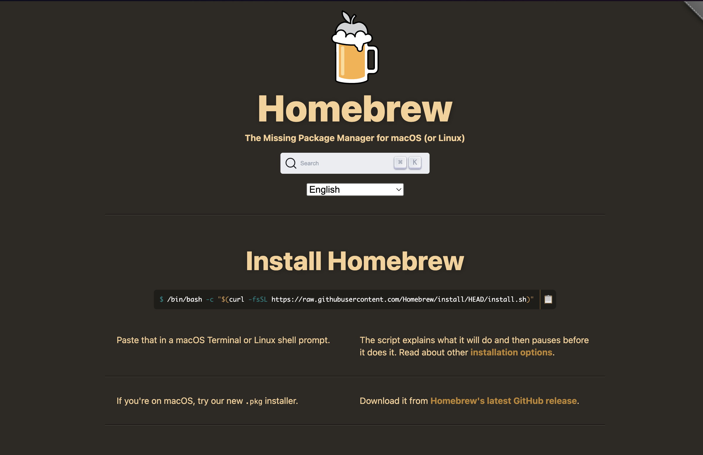
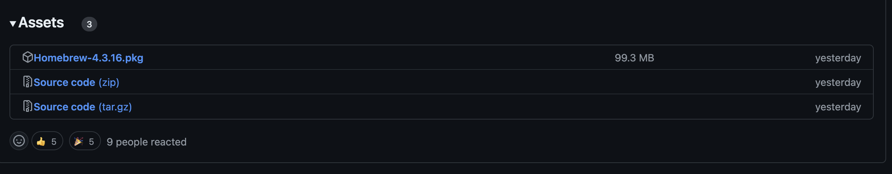
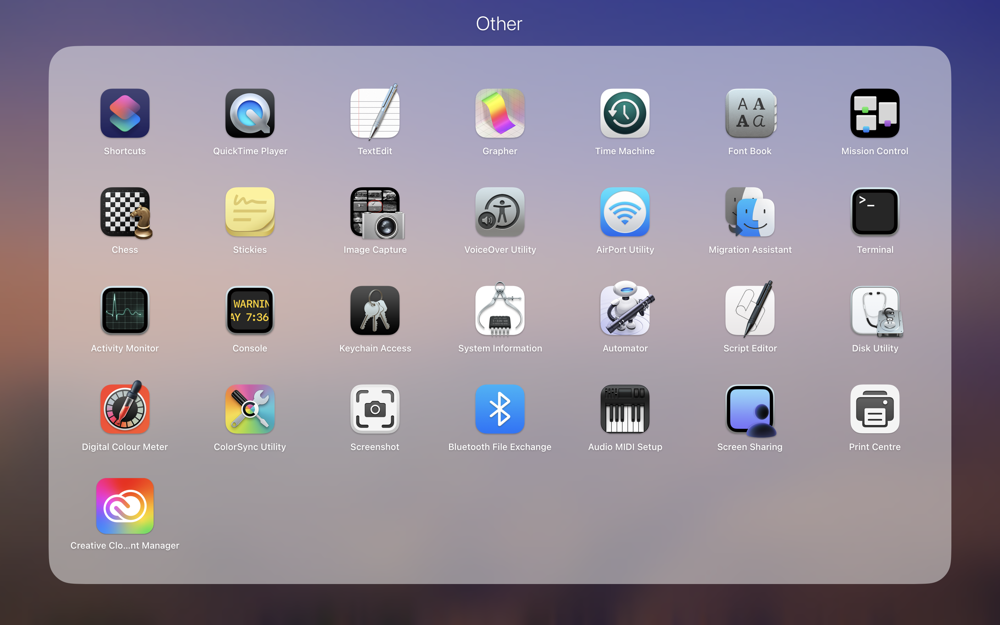
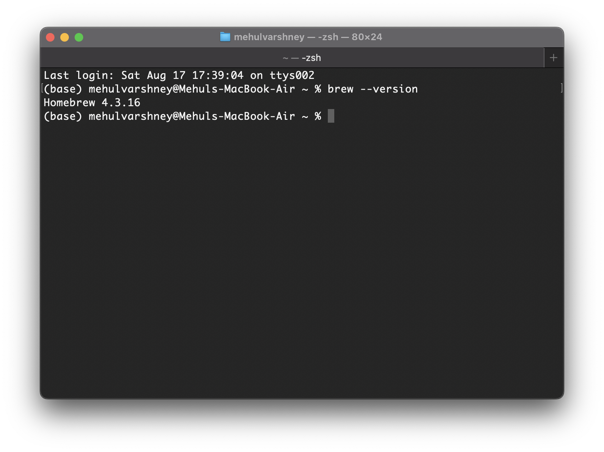
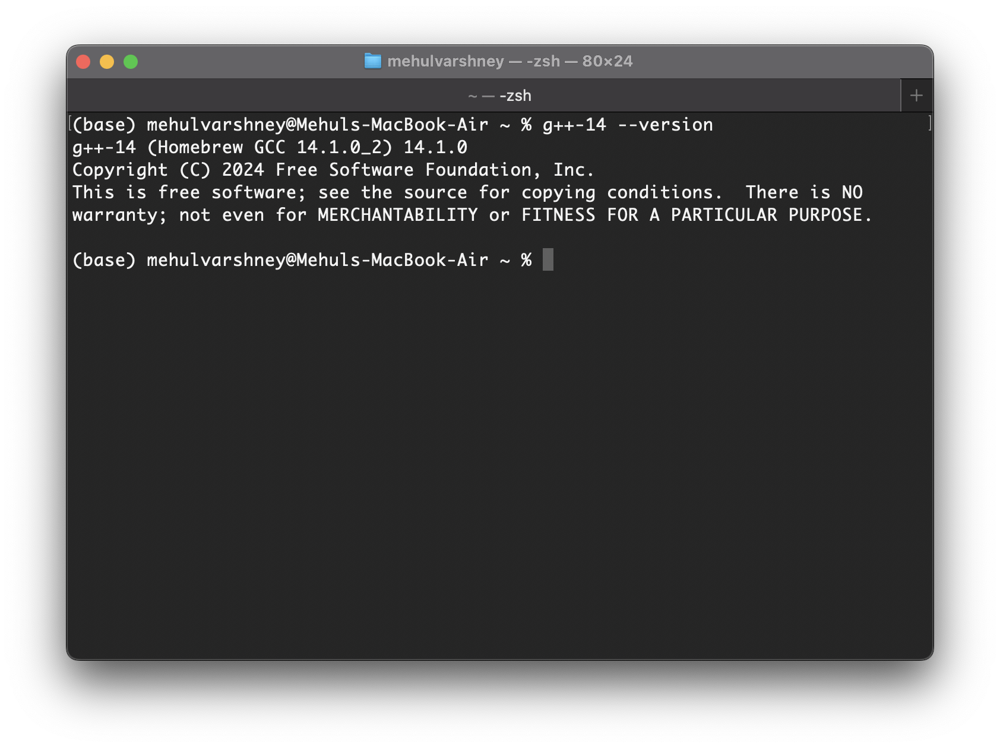
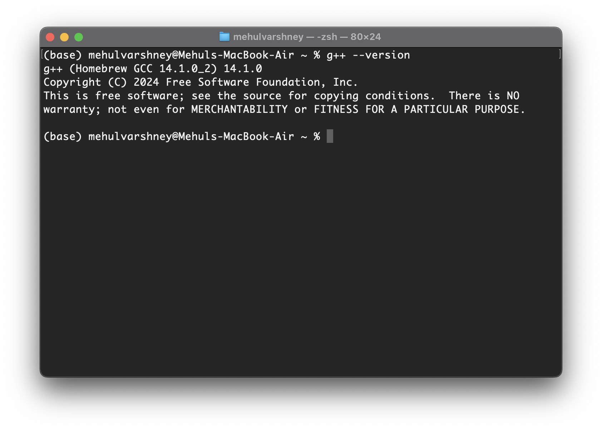
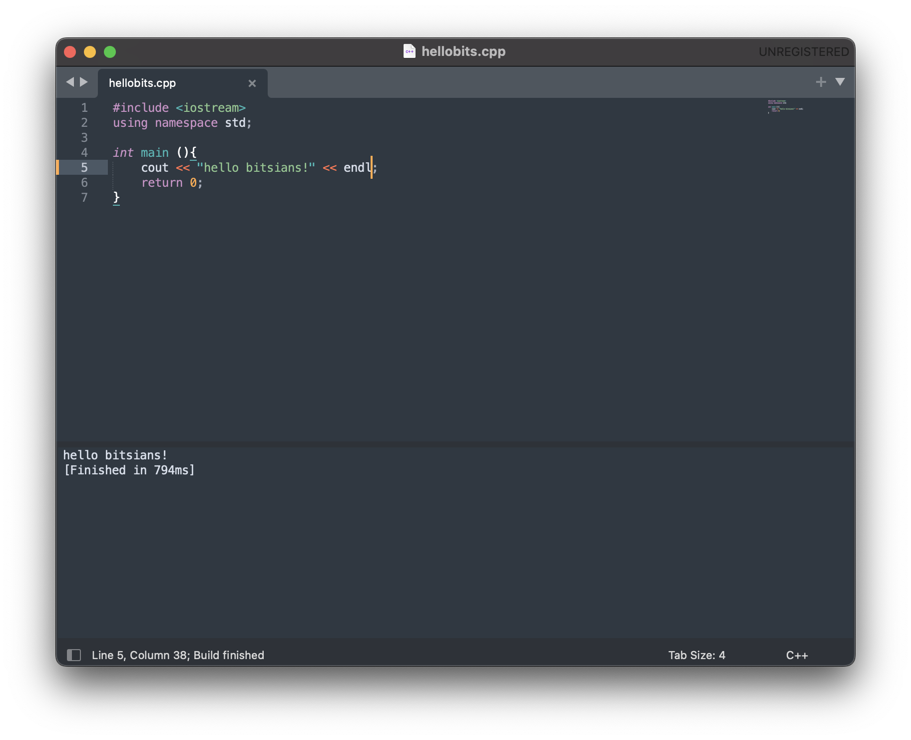

# Installation Guide

## For Mac

1. Go to [Homebrew official website](https://brew.sh/) and click on "Download it from [Homebrew&#39;s latest GitHub release](https://github.com/Homebrew/brew/releases/latest)"

   
2. Scroll down and click on Homebrew-4.3.16.pkg (or whichever is the latest release).

   
3. Now open the Terminal by visiting Launchpad > Others or simply press Cmd+X to toggle Spotlight and search for Terminal.

   
4. In the terminal, type the command `brew --version`. On a successful installation of brew, you should see something like this.

   
5. Now its time to **install GCC compiler** in your Mac.
6. Open terminal and type `brew install gcc`
7. Now type `g++-14 --version` and it will show the **current version of the gcc compiler** installed.

   
8. Now type `g++ --version` it will show apple clang instead of gcc. Something like [this](https://imgur.com/a/jkl3zLO).
9. That means the current default compiler is clang not gcc. So we have to set it to **GCC compiler as the default compiler** .
10. Now type `cd /opt/homebrew/bin`, press enter and then type `ln -s g++-14 g++` and press enter.
11. Now again type `g++ --version` and it will show something like:

    
12. That means you have **successfully installed gcc in your Mac and has been set as the default compiler.**
13. Go to [Sublime text website](https://www.sublimetext.com)
14. Click on Download. Move the downloaded application from Downloads folder to the Applications folder.
15. Open Sublime Text app. Write a normal program and press Cmd + B. You should see an output in the window.

